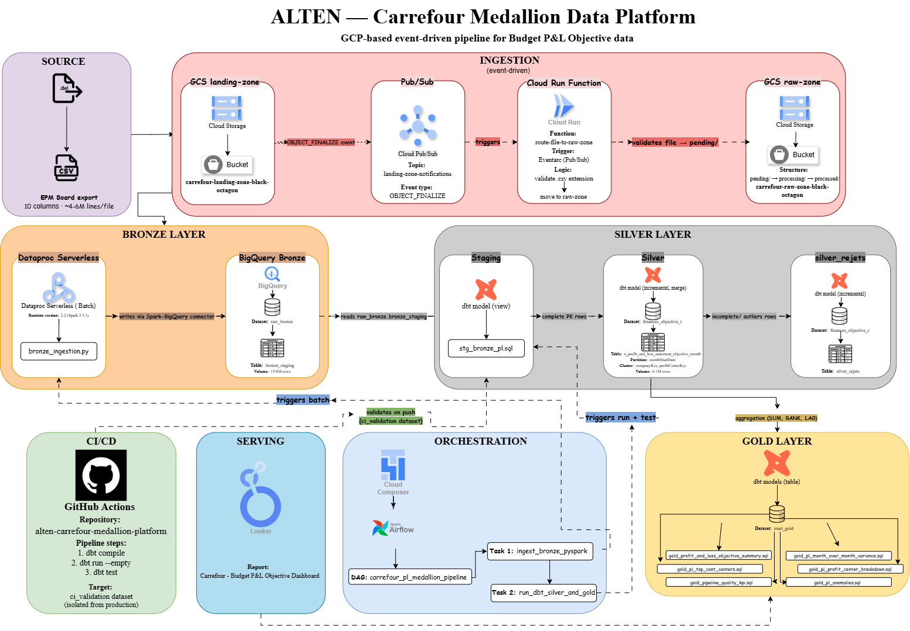
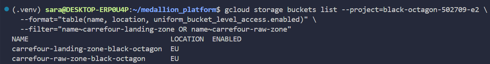
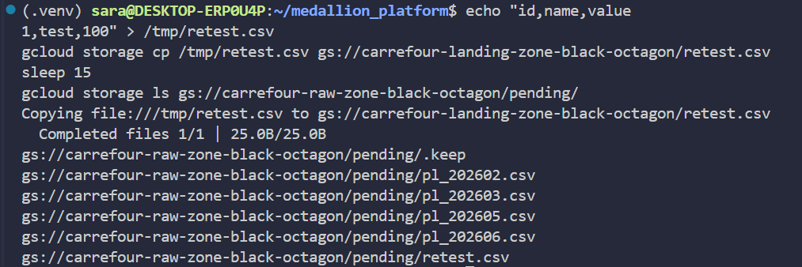
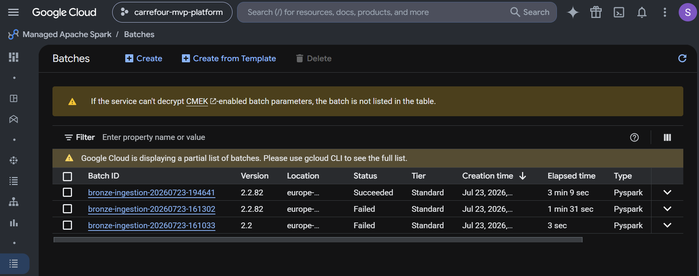
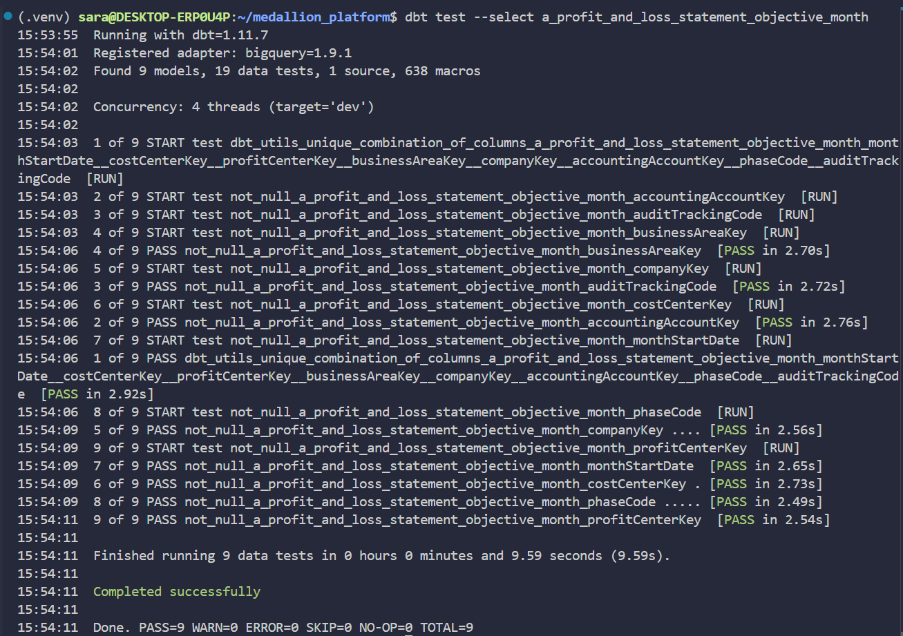
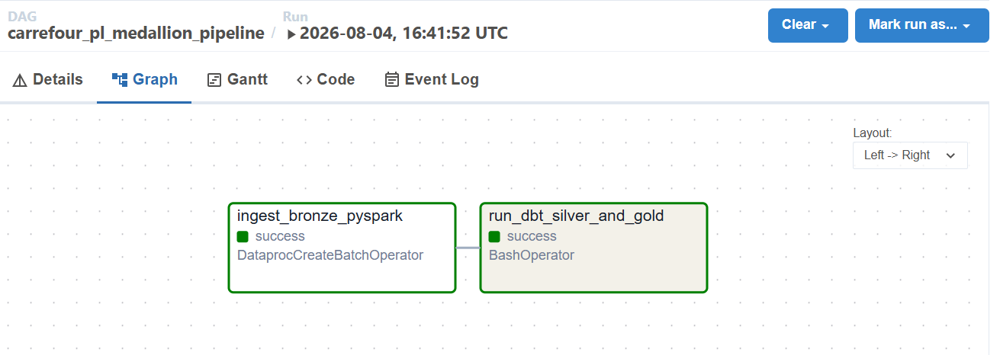
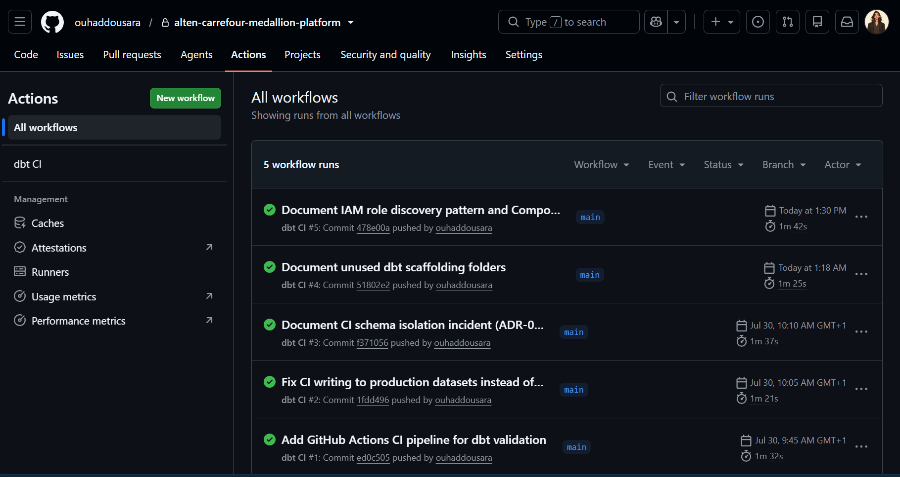
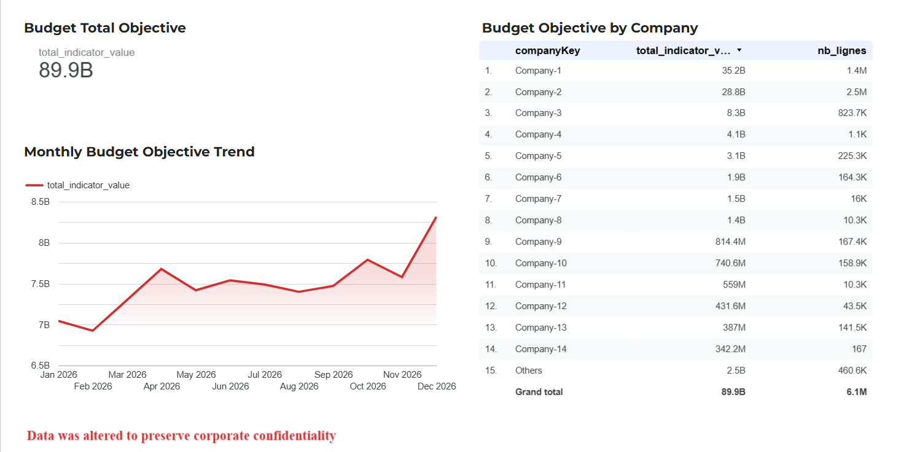

<div align="center">

# ALTEN — Carrefour Medallion Data Platform

**GCP-based event-driven pipeline for Budget P&L Objective data**
*Bronze → Silver → Gold, fully orchestrated, tested, and CI/CD-validated*

[](https://github.com/ouhaddousara/alten-carrefour-medallion-platform/actions/workflows/ci.yml)


</div>

---

## Architecture



*Full system architecture: event-driven ingestion (GCS/Pub/Sub/Cloud Run), Bronze layer (Dataproc Serverless), Silver/Gold transformation (dbt), orchestration (Cloud Composer), serving (Looker Studio), and CI/CD (GitHub Actions).*

Additional diagrams: [sequence diagram](docs/diagrams/sequence-diagram.png) · [use case diagram](docs/diagrams/use-case-diagram.png)

---

## Table of Contents

- [Overview](#overview)
- [Tech Stack](#tech-stack)
- [Project Structure](#project-structure)
- [Pipeline Walkthrough](#pipeline-walkthrough)
  - [1. Event-Driven Ingestion](#1-event-driven-ingestion)
  - [2. Bronze Layer](#2-bronze-layer-pyspark--dataproc-serverless)
  - [3. Silver & Gold Layers](#3-silver--gold-layers-dbt)
  - [4. Orchestration](#4-orchestration-cloud-composer--airflow)
  - [5. CI/CD](#5-cicd-github-actions)
  - [6. Serving](#6-serving-looker-studio)
- [Architecture Decision Records](#architecture-decision-records)
- [Data Confidentiality](#data-confidentiality)
- [Deployment](#deployment)
- [Acknowledgments](#acknowledgments)

---

## Overview

Carrefour's Budget P&L Objective data is exported monthly from EPM Board as flat files (tab-delimited, ANSI encoding) — historically processed manually. This project builds a **fully automated, event-driven Medallion data platform** on GCP that:

- Detects new files automatically (no polling)
- Ingests and type-validates raw data at scale (15.8M+ rows)
- Cleans, deduplicates, and flags data quality issues
- Aggregates business-ready metrics
- Serves a live dashboard
- Runs daily, unattended, with automated testing on every code change

Built as a 4-week internship project at ALTEN, under the supervision of
M. Walid Amara, for an actual Carrefour use case (financial values
altered — see [Data Confidentiality](#data-confidentiality)).

---

## Tech Stack

| Layer | Technology |
|---|---|
| Event-driven storage | Google Cloud Storage + Pub/Sub |
| File routing | Cloud Run Functions (Gen2) |
| Distributed ingestion | PySpark on Dataproc Serverless |
| Data warehouse | BigQuery |
| Transformation | dbt Core |
| Orchestration | Cloud Composer (Airflow 2) |
| CI/CD | GitHub Actions + Workload Identity Federation (keyless auth) |
| Visualization | Looker Studio |
| Decision documentation | Architecture Decision Records (ADR) |

---

## Project Structure

```
alten-carrefour-medallion-platform/
├── .github/workflows/ci.yml           # CI: dbt compile → run --empty → test
├── cloud_run_function/                # Week 1 — event-driven file routing
│   ├── main.py
│   └── requirements.txt
├── pyspark_ingestion/                  # Week 2 — Bronze ingestion
│   └── bronze_ingestion.py
├── models/                             # Week 3 — dbt models
│   ├── staging/                        # Transform-only layer (no filtering)
│   ├── silver/                         # Deduplicated, outlier-excluded, tested
│   └── gold/                           # 6 business-ready aggregations
├── macros/
│   └── generate_schema_name.sql        # CI/prod schema isolation
├── airflow_dags/                       # Week 4 — orchestration
│   └── carrefour_pl_medallion_pipeline.py
├── composer_deploy/                    # Deployment procedure & config
│   ├── DEPLOYMENT.md
│   └── profiles_composer.yml
├── docs/
│   ├── decisions/                      # 12 ADRs — full technical rationale
│   ├── diagrams/                       # Architecture, sequence, use case
│   └── screenshots/                    # Visual proof, organized by week
├── dbt_project.yml
└── packages.yml
```

---

## Pipeline Walkthrough

### 1. Event-Driven Ingestion

A file dropped in `landing-zone` triggers an automatic chain: GCS → Pub/Sub → Cloud Run Function (validates `.csv` extension) → routed into `raw-zone/pending/`. No polling, no manual intervention.

| | |
|---|---|
|  |  |
| GCS buckets (landing/raw zone) | End-to-end test: valid file auto-routed to `pending/` |

Structure: `pending/` → `processing/` → `processed/` (see [ADR-001](docs/decisions/001-three-state-raw-zone-structure.md))

More: [Cloud Run function state](docs/screenshots/week1/03-cloud-run-service-state.png) · [source code](docs/screenshots/week1/04-cloud-run-source-code.png) · [validation logs](docs/screenshots/week1/06-cloud-run-logs.png)

---

### 2. Bronze Layer (PySpark & Dataproc Serverless)

Raw CSVs are read with a strict, source-faithful schema (all `STRING` except the value column — see [ADR-004](docs/decisions/004-bronze-schema-source-fidelity.md)) and loaded into BigQuery at scale.



**Result:** 15,865,021 rows ingested successfully.

More: [row count](docs/screenshots/week2/01-bronze-row-count.png) · [schema](docs/screenshots/week2/02-bronze-schema-console.png) · [batch detail](docs/screenshots/week2/04-dataproc-batch-detail.png)

Local vs. Dataproc Serverless connector handling documented in [ADR-003](docs/decisions/003-local-vs-dataproc-serverless-connectors.md).

---

### 3. Silver & Gold Layers (dbt)

**Silver** deduplicates (`QUALIFY ROW_NUMBER`), applies business rules (NCC), excludes statistical outliers (>10 std dev, confirmed source anomaly — see [ADR-005](docs/decisions/005-silver-deduplication-strategy.md), [ADR-008](docs/decisions/008-outlier-detection-and-data-anomaly.md)), and merges on an 8-field composite key.

**Gold** produces 6 business-ready aggregations: summary, month-over-month variance, top cost centers, profit center breakdown, pipeline quality KPI, anomaly monitoring.



**Result:** 15.8M raw rows → 6.1M deduplicated, validated rows (9/9 tests passing).

More: [dedup proof](docs/screenshots/week3/03-silver-dedup-count.png) · [rejects tracking](docs/screenshots/week3/04-silver-rejets-count-only.png) · [Gold models run](docs/screenshots/week3/05-gold-models-run.png) · [Gold dataset overview](docs/screenshots/week3/06-gold-dataset-overview.png)

A shared staging model avoids duplicating transformation logic between Silver and the rejects table ([ADR-006](docs/decisions/006-shared-staging-model-pattern.md)).

---

### 4. Orchestration (Cloud Composer / Airflow)

A daily DAG (`carrefour_pl_medallion_pipeline`) sequences Bronze ingestion (`DataprocCreateBatchOperator`) and dbt transformation (`BashOperator`, isolated venv), with Task 2 running only if Task 1 succeeds.



**Result:** `ingest_bronze_pyspark` → SUCCESS, `run_dbt_silver_and_gold` → SUCCESS (dbt run 9/9, dbt test 19/19).

This environment required extensive troubleshooting — 7 failed creation attempts traced to a regional SSD quota exhaustion masked by generic error messages, followed by 6 additional environment-specific compatibility fixes (GCSFuse performance, dbt version mismatches). Full root-cause analysis: [ADR-011](docs/decisions/011-composer-environment-creation-incident.md), [ADR-012](docs/decisions/012-composer-resolution-final.md).

More: [environment running](docs/screenshots/week4/05-composer-env-running.png) · [DAG list](docs/screenshots/week4/06-airflow-dag-list.png) · [execution logs](docs/screenshots/week4/10a-airflow-logs-dataproc-task.png)

Once validated, the environment was deleted to control ongoing infrastructure costs — see [environment deletion](docs/screenshots/week4/12-composer-deleted.png).

---

### 5. CI/CD (GitHub Actions)

Every push to `main` triggers `dbt compile` → `dbt run --empty` → `dbt test`, authenticated via **Workload Identity Federation** (no service account key stored), isolated in a dedicated `ci_validation` dataset — never touching production.



An early version of this pipeline accidentally wrote to production datasets due to a schema-naming macro bug — caught, fixed, and documented in [ADR-009](docs/decisions/009-ci-schema-isolation-incident.md).

More: [run detail](docs/screenshots/week4/02-ci-run-detail.png) · [Workload Identity Federation](docs/screenshots/week4/03-workload-identity-pool.png)

---

### 6. Serving (Looker Studio)

A live dashboard built on Gold tables: total Budget, monthly trend, top 15 companies by spend.



*Data was altered to preserve corporate confidentiality.*

---

## Architecture Decision Records

Every significant technical decision, incident, and its resolution is documented as an ADR — the full reasoning trail, not just the final code.

| # | Title | Week |
|---|---|---|
| [001](docs/decisions/001-three-state-raw-zone-structure.md) | Three-state structure for raw-zone | 1 |
| [002](docs/decisions/002-least-privilege-service-account.md) | Least-privilege IAM for service account | 1 |
| [003](docs/decisions/003-local-vs-dataproc-serverless-connectors.md) | Local vs. Dataproc Serverless connector handling | 2 |
| [004](docs/decisions/004-bronze-schema-source-fidelity.md) | Bronze schema faithful to source | 2 |
| [005](docs/decisions/005-silver-deduplication-strategy.md) | Silver deduplication strategy | 3 |
| [006](docs/decisions/006-shared-staging-model-pattern.md) | Shared staging model pattern | 3 |
| [007](docs/decisions/007-custom-schema-naming-macro.md) | Custom schema naming macro | 3 |
| [008](docs/decisions/008-outlier-detection-and-data-anomaly.md) | Outlier detection & data anomaly | 3 |
| [009](docs/decisions/009-ci-schema-isolation-incident.md) | CI schema isolation incident | 4 |
| [010](docs/decisions/010-iterative-iam-role-discovery.md) | Iterative IAM role discovery pattern | 4 |
| [011](docs/decisions/011-composer-environment-creation-incident.md) | Composer creation incident (SSD quota root cause) | 4 |
| [012](docs/decisions/012-composer-resolution-final.md) | Composer resolution — final validated deployment | 4 |

Full index: [`docs/decisions/README.md`](docs/decisions/README.md)

---

## Data Confidentiality

This project processes altered Carrefour financial data. Values follow
the same structure and business rules as the original source, adjusted
within a narrow range that produces figures close to the true financial
data — altered by M. Walid Amara (project supervisor) to preserve
corporate confidentiality. No raw or original financial data is exposed
in this repository.

---

## Deployment

Full step-by-step deployment procedure (Composer environment setup, DAG/dbt project sync, PyPI packages): [`composer_deploy/DEPLOYMENT.md`](composer_deploy/DEPLOYMENT.md)

---

## Acknowledgments

**Internship:** ALTEN
**Supervisor:** M. Walid Amara
**Author:** Sara Ouhaddou

Built as a 4-week internship project demonstrating end-to-end GCP data engineering: event-driven architecture, distributed processing, analytics engineering, orchestration, and DevOps practices — including honest documentation of failures, root-cause diagnosis, and resolution.
